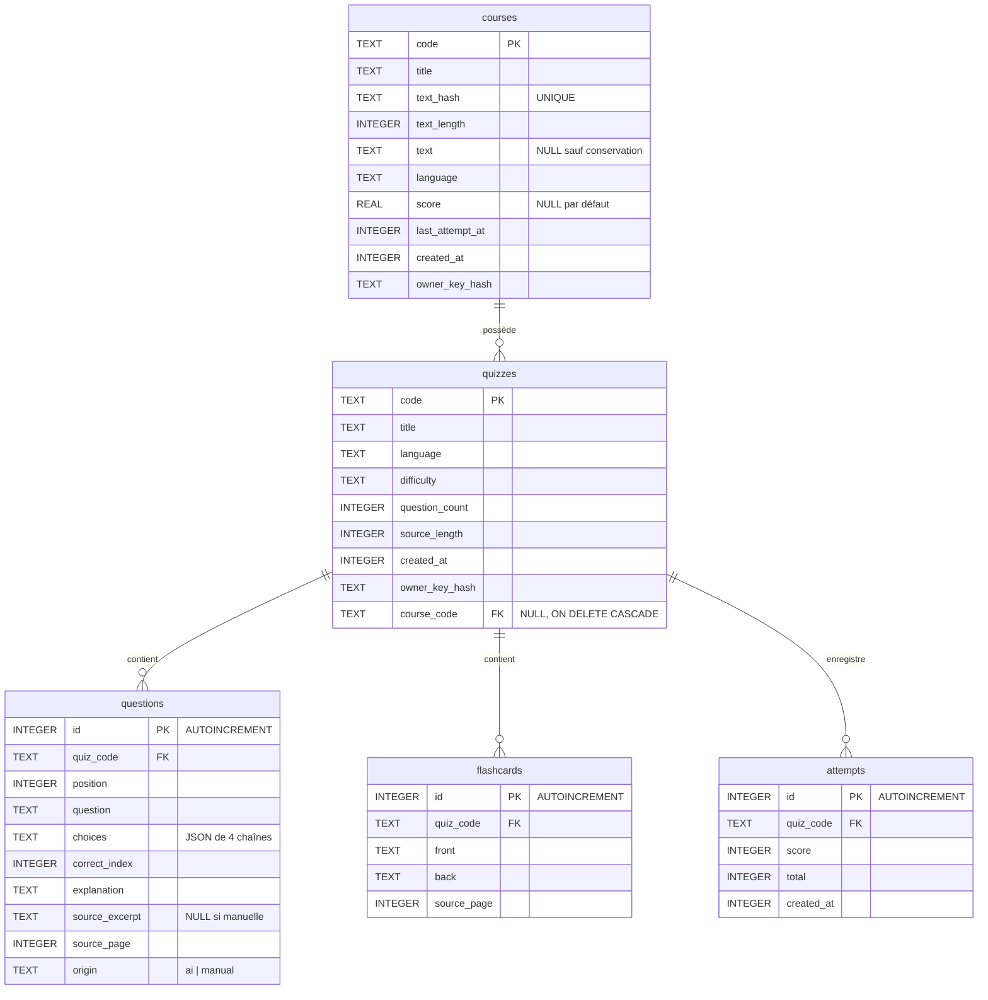

# Modèle de données (version simplifiée)

Diagramme entité-association généré depuis `server/db/schema.sql` (base SQLite).
Principe : on stocke le quiz, jamais le texte du cours — `courses.text` n'est
renseigné que si l'utilisateur choisit de conserver le texte. Clés primaires en
`PK`, clés étrangères en `FK` (toutes en `ON DELETE CASCADE` vers le parent).

