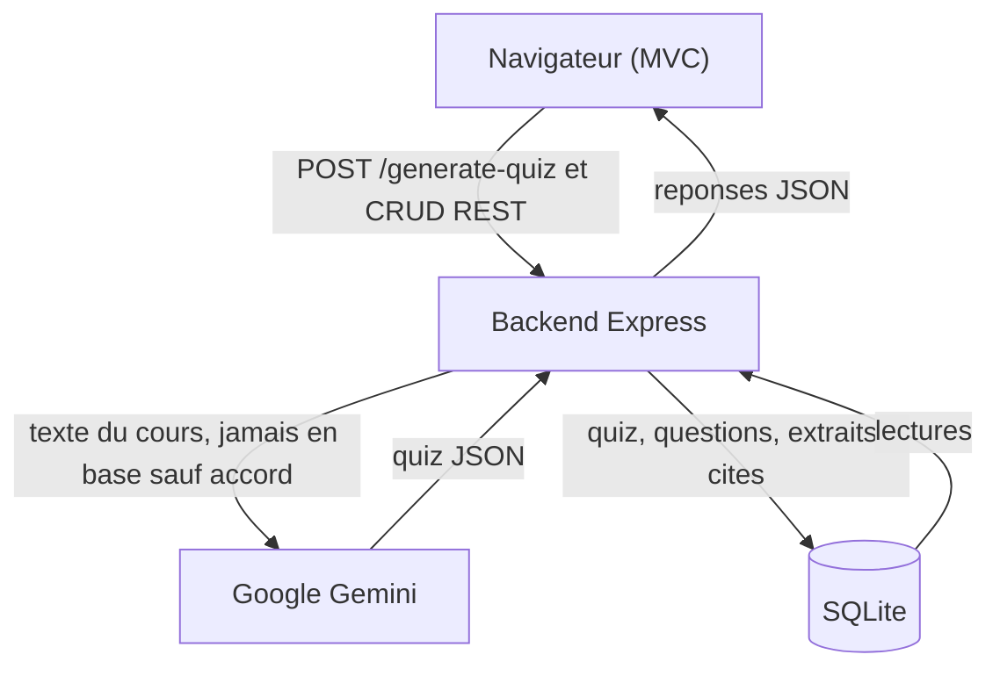

# Architecture générale (version simplifiée)

Vue à quatre blocs pour le rapport (schéma détaillé en annexe :
`architecture.md`). Seuls les flux principaux entre blocs sont montrés.

Confidentialité : le texte du cours ne sort que vers Gemini pour la
génération ; la base ne conserve que le quiz, les questions et les extraits
cités — jamais le texte complet, sauf si l'utilisateur choisit de le conserver.
