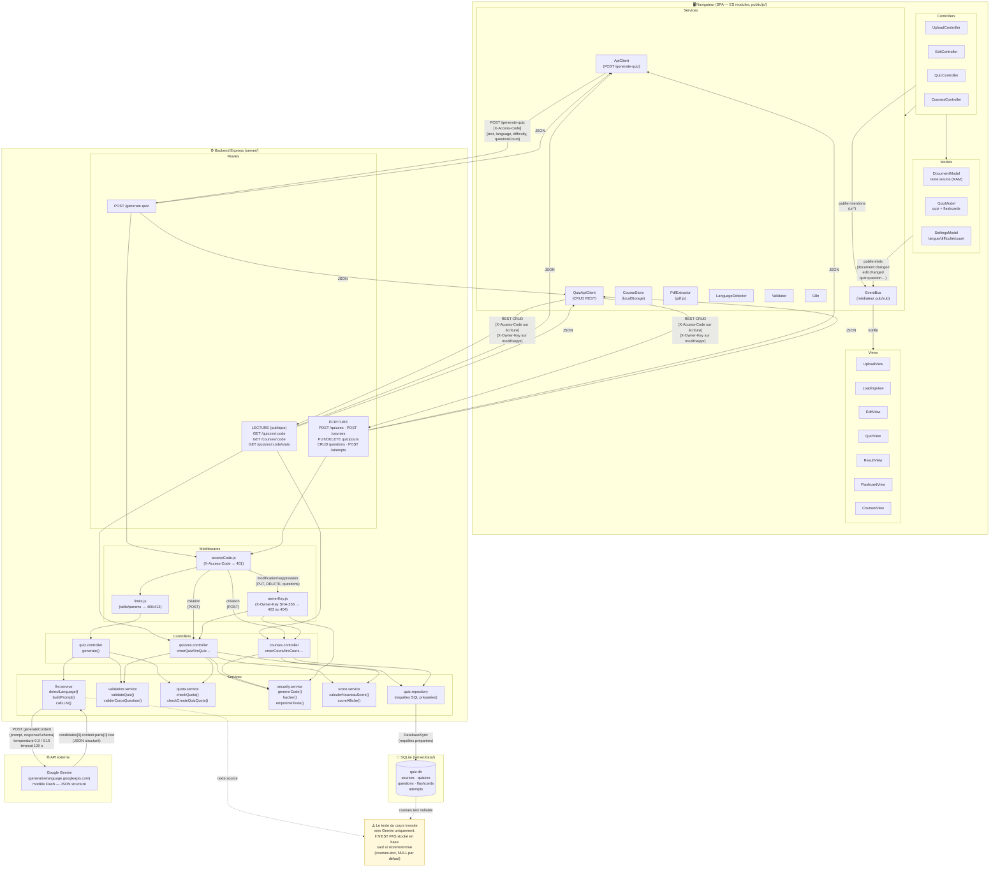

# Schéma d'architecture générale



## Légende des flux principaux

| Flèche | Signification |
|--------|---------------|
| `ApiClient → POST /generate-quiz` | Envoi du texte, des paramètres et du code d'accès. Le texte n'est **pas** persisté côté backend avant de partir vers Gemini. |
| `LLMService → Gemini` | Le texte du cours est transmis à Gemini pour générer les questions. C'est le **seul** chemin où le texte sort du navigateur et du backend. |
| `quiz.repository → SQLite` | Seuls le quiz, les questions (avec `source_excerpt`) et les métadonnées sont persistés. **Jamais le texte complet du cours**, sauf `courses.text` si `storeText=true`. |
| `QuizApiClient → REST CRUD` | Enregistrement, lecture, modification et suppression des quiz, questions, cours et tentatives. |
| `CourseStore → localStorage` | Persistance locale (dans le navigateur) des codes et clés des cours créés depuis ce navigateur. |
| `R2R` (lecture) | Consultation d'un quiz, d'un cours ou de ses statistiques : accessible sans code d'accès, protégée uniquement par le code à 6 caractères non devinable. Nécessaire pour que l'onglet « Mes cours » fonctionne après un rechargement de page, sans ressaisie du code d'accès. |
| `R2W` (écriture) | Création, modification, suppression : exige toujours le code d'accès. La modification/suppression d'un quiz ou d'un cours, ainsi que le CRUD des questions, exige en plus la bonne `X-Owner-Key`. Le middleware `ownerKey.js` renvoie **403** si la clé est absente ou incorrecte, **404** si la ressource n'existe pas. |

## Principe de confidentialité du texte (du code vers le schéma)

```
DocumentModel (RAM) ──► ApiClient ──► POST /generate-quiz ──► llm.service ──► Gemini
                                            │
                                            └──► validation.service (ancrage)
                                                         │
                                                         ▼
                                   quiz validé (questions + source_excerpt) renvoyé au
                                   navigateur — la génération ne persiste RIEN en base

navigateur ──► QuizApiClient ──► POST /quizzes ──► quizzes.controller ──► quiz.repository
                                                                                │
                                                                                ▼
                                     questions.source_excerpt (extrait cité, jamais le texte entier)

courses.text (SQLite) ← courses.controller ← POST /courses
  ╰── NULL par défaut
  ╰── non-NULL uniquement si body.storeText === true
```

## Note sur l'évolution de ce schéma (post-correctif)

Une version antérieure de ce diagramme faisait passer **toutes** les routes
`/quizzes/:code` et `/courses/:code` (lecture comme écriture) par
`accessCode.js` et `ownerKey.js`. Cela provoquait un bug réel : l'onglet
« Mes cours » recevait une erreur 401 après un rechargement de page, car le
code d'accès n'est conservé qu'en **mémoire** côté client (jamais dans
`localStorage` ni `sessionStorage` — voir `SettingsModel.js`) : il est oublié
au rechargement (F5) et n'était donc plus transmis. Le correctif a consisté à séparer les routes de lecture
(consultation, sans coût de quota LLM) des routes d'écriture, en ne
protégeant les premières que par leur code non devinable.