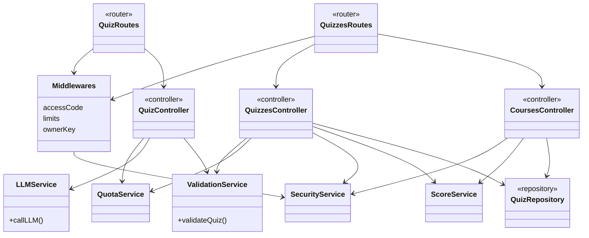

# Diagramme de classes — Backend (version simplifiée)

Version condensée pour le rapport (complet en annexe : `class-diagram-back.md`).
Vue en couches : routes → middlewares → controllers → services → repository.
Les trois middlewares sont regroupés en un seul bloc.

