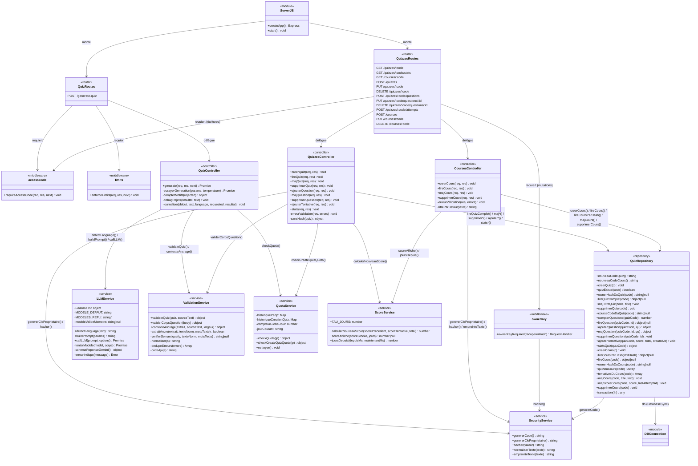

# Diagramme de classes — Backend (server/)

```mermaid
classDiagram
    direction TB

    %% ════════════════════════════════════════════════════════════
    %% POINT D'ENTRÉE
    %% ════════════════════════════════════════════════════════════

    class ServerJS {
        <<module>>
        +createApp() Express
        +start() void
    }

    %% ════════════════════════════════════════════════════════════
    %% MIDDLEWARES
    %% ════════════════════════════════════════════════════════════

    class accessCode {
        <<middleware>>
        +requireAccessCode(req, res, next) void
        %% Lit process.env.ACCESS_CODE
        %% 401 INVALID_CODE si code absent/incorrect
        %% laisse passer si ACCESS_CODE non défini (dev)
    }

    class limits {
        <<middleware>>
        +enforceLimits(req, res, next) void
        %% 400 TEXT_TOO_SHORT  (< 300 car.)
        %% 413 TEXT_TOO_LONG   (> MAX_TEXT_LENGTH)
        %% 400 INVALID_LANGUAGE / INVALID_DIFFICULTY
        %% 400 INVALID_QUESTION_COUNT
    }

    class ownerKey {
        <<middleware>>
        +ownerKeyRequired(recupererHash) RequestHandler
        %% 404 NOT_FOUND si ressource absente
        %% 403 FORBIDDEN si hash SHA-256 ne correspond pas
    }

    %% ════════════════════════════════════════════════════════════
    %% ROUTES
    %% ════════════════════════════════════════════════════════════

    class QuizRoutes {
        <<router>>
        POST /generate-quiz
        %% Chaîne: requireAccessCode → enforceLimits → generate
    }

    class QuizzesRoutes {
        <<router>>
        GET /quizzes/:code
        GET /quizzes/:code/stats
        GET /courses/:code
        POST /quizzes
        PUT /quizzes/:code
        DELETE /quizzes/:code
        POST /quizzes/:code/questions
        PUT /quizzes/:code/questions/:id
        DELETE /quizzes/:code/questions/:id
        POST /quizzes/:code/attempts
        POST /courses
        PUT /courses/:code
        DELETE /courses/:code
    }

    %% ════════════════════════════════════════════════════════════
    %% CONTROLLERS
    %% ════════════════════════════════════════════════════════════

    class QuizController {
        <<controller>>
        +generate(req, res, next) Promise
        -essayerGeneration(params, temperature) Promise
        -compterMotifs(rejected) object
        -debugRejets(resultat, text) void
        -journaliser(debut, text, language, requested, resultat) void
    }

    class QuizzesController {
        <<controller>>
        +creerQuiz(req, res) void
        +lireQuiz(req, res) void
        +majQuiz(req, res) void
        +supprimerQuiz(req, res) void
        +ajouterQuestion(req, res) void
        +majQuestion(req, res) void
        +supprimerQuestion(req, res) void
        +ajouterTentative(req, res) void
        +stats(req, res) void
        -erreurValidation(res, errors) void
        -sansHash(quiz) object
    }

    class CoursesController {
        <<controller>>
        +creerCours(req, res) void
        +lireCours(req, res) void
        +majCours(req, res) void
        +supprimerCours(req, res) void
        -erreurValidation(res, errors) void
        -titreParDefaut(texte) string
    }

    %% ════════════════════════════════════════════════════════════
    %% SERVICES
    %% ════════════════════════════════════════════════════════════

    class LLMService {
        <<service>>
        -GABARITS: object
        -MODELE_DEFAUT: string
        -MODELES_REPLI: string[]
        -modeleValideMemoire: string|null
        +detectLanguage(text) string
        +buildPrompt(params) string
        +callLLM(prompt, options) Promise
        -tenterModele(model, corps) Promise
        -schemaReponseGemini() object
        -erreurIndispo(message) Error
    }

    class ValidationService {
        <<service>>
        +validateQuiz(quiz, sourceText) object
        +validerCorpsQuestion(body) object
        +contexteAncrage(extrait, sourceText, largeur) object
        -extraitAncre(extrait, texteNorm, motsTexte) boolean
        -verifierSemantique(q, texteNorm, motsTexte) string|null
        -normaliser(s) string
        -dedupeErreurs(errors) Array
        -codeAjv(e) string
    }

    class QuotaService {
        <<service>>
        -historiqueParIp: Map
        -historiqueCreationQuiz: Map
        -compteurGlobalJour: number
        -jourCourant: string
        +checkQuota(ip) object
        +checkCreateQuizQuota(ip) object
        +nettoyer() void
    }

    class SecurityService {
        <<service>>
        +genererCode() string
        +genererCleProprietaire() string
        +hacher(valeur) string
        +normaliserTexte(texte) string
        +empreinteTexte(texte) string
    }

    class ScoreService {
        <<service>>
        +TAU_JOURS: number
        +calculerNouveauScore(scorePrecedent, scoreTentative, total) number
        +scoreAffiche(scoreStocke, jours) number|null
        +joursDepuis(depuisMs, maintenantMs) number
    }

    class QuizRepository {
        <<repository>>
        +nouveauCodeQuiz() string
        +nouveauCodeCours() string
        +creerQuiz(q) void
        +quizExiste(code) boolean
        +ownerHashDuQuiz(code) string|null
        +lireQuizComplet(code) object|null
        +majTitreQuiz(code, title) void
        +supprimerQuiz(code) void
        +courseCodeDuQuiz(code) string|null
        +compterQuestions(quizCode) number
        +lireQuestion(quizCode, id) object|null
        +ajouterQuestion(quizCode, qu) object
        +majQuestion(quizCode, id, qu) object
        +supprimerQuestion(quizCode, id) void
        +ajouterTentative(quizCode, score, total, createdAt) void
        +statsQuiz(quizCode) object
        +creerCours(c) void
        +lireCoursParHash(textHash) object|null
        +lireCours(code) object|null
        +ownerHashDuCours(code) string|null
        +quizDuCours(code) Array
        +tentativesDuCours(code) Array
        +majCours(code, title, text) void
        +majScoreCours(code, score, lastAttemptAt) void
        +supprimerCours(code) void
        -transaction(fn) any
    }

    class DBConnection {
        <<module>>
        %% node:sqlite DatabaseSync
        %% Applique schema.sql au chargement
        %% PRAGMA foreign_keys = ON
    }

    %% ════════════════════════════════════════════════════════════
    %% RELATIONS
    %% ════════════════════════════════════════════════════════════

    ServerJS --> QuizRoutes : monte
    ServerJS --> QuizzesRoutes : monte

    QuizRoutes --> accessCode : requiert
    QuizRoutes --> limits : requiert
    QuizRoutes --> QuizController : délègue

    QuizzesRoutes --> accessCode : requiert (écritures)
    QuizzesRoutes --> ownerKey : requiert (mutations)
    QuizzesRoutes --> QuizzesController : délègue
    QuizzesRoutes --> CoursesController : délègue

    QuizController --> QuotaService : checkQuota()
    QuizController --> LLMService : detectLanguage() / buildPrompt() / callLLM()
    QuizController --> ValidationService : validateQuiz() / contexteAncrage()

    QuizzesController --> QuizRepository : creerQuiz() / lireQuizComplet() / maj*() / supprimer*() / ajouter*() / stats*()
    QuizzesController --> ValidationService : validerCorpsQuestion()
    QuizzesController --> QuotaService : checkCreateQuizQuota()
    QuizzesController --> SecurityService : genererCleProprietaire() / hacher()
    QuizzesController --> ScoreService : calculerNouveauScore()

    CoursesController --> QuizRepository : creerCours() / lireCours() / lireCoursParHash() / majCours() / supprimerCours()
    CoursesController --> SecurityService : genererCleProprietaire() / hacher() / empreinteTexte()
    CoursesController --> ScoreService : scoreAffiche() / joursDepuis()

    ownerKey --> SecurityService : hacher()

    QuizRepository --> DBConnection : db (DatabaseSync)
    QuizRepository --> SecurityService : genererCode()
```
