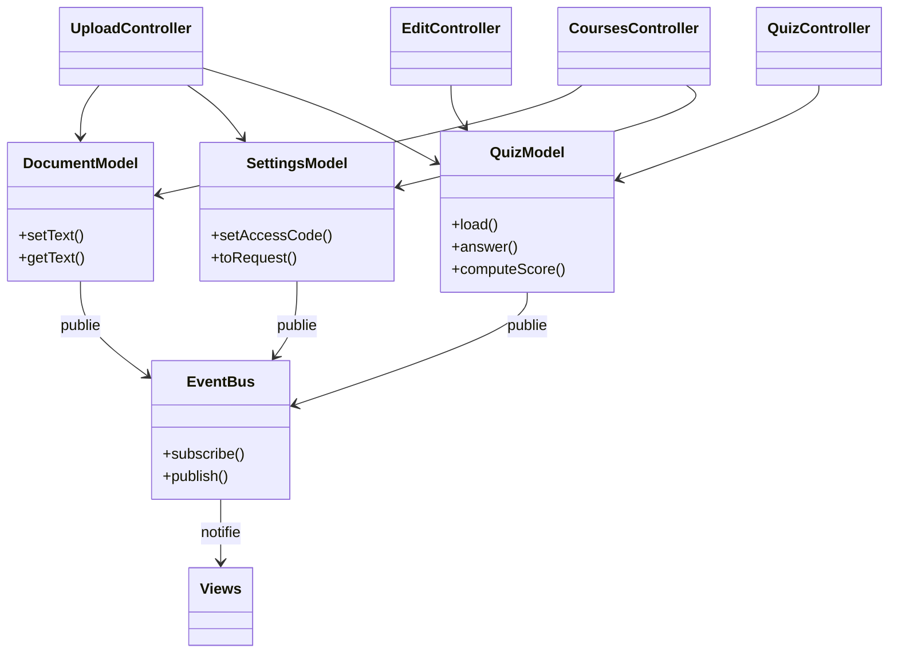
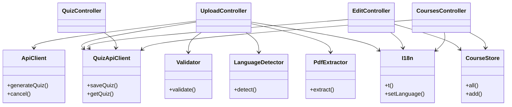

# Diagramme de classes — Front (version simplifiée)

Version condensée pour le rapport. Le diagramme complet reste en annexe
(`class-diagram-front.md`). Scindé en deux vues.

## a) Cœur MVC

Principe : les Controllers pilotent les Models ; les Models publient leurs
états via l'EventBus, qui notifie les Views.

## b) Services

Chaque service est relié au Controller qui l'appelle.

