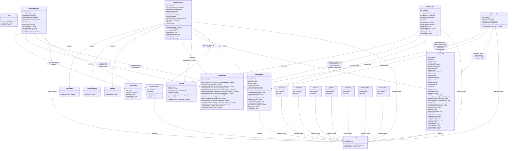

# Diagramme de classes — Front (public/js/)

```mermaid
classDiagram
    direction TB

    %% ════════════════════════════════════════════════════════════
    %% SERVICES (couche transverse)
    %% ════════════════════════════════════════════════════════════

    class EventBus {
        -_handlers: Map
        +subscribe(event, handler) Function
        +publish(event, payload) void
    }

    class I18n {
        +setLanguage(lang) void
        +t(key, vars) string
        +isoLTR(n) string
    }

    class ApiClient {
        -baseUrl: string
        -timeoutMs: number
        -_controleurCourant: AbortController
        -_cancelled: boolean
        +generateQuiz(payload, accessCode) Promise
        +cancel() void
        -_attempt(payload, accessCode) Promise
    }

    class QuizApiClient {
        -baseUrl: string
        +saveQuiz(payload, accessCode, courseOwnerKey) Promise
        +getQuiz(code, accessCode) Promise
        +updateQuizTitle(code, title, accessCode, ownerKey) Promise
        +deleteQuiz(code, accessCode, ownerKey) Promise
        +addQuestion(code, question, accessCode, ownerKey) Promise
        +updateQuestion(code, id, question, accessCode, ownerKey) Promise
        +deleteQuestion(code, id, accessCode, ownerKey) Promise
        +addAttempt(code, score, total, accessCode) Promise
        +getStats(code, accessCode) Promise
        +createCourse(payload, accessCode) Promise
        +getCourse(code, accessCode, ownerKey) Promise
        +updateCourse(code, payload, accessCode, ownerKey) Promise
        +deleteCourse(code, accessCode, ownerKey) Promise
        -_request(method, chemin, opts) Promise
        -_fetch(method, chemin, opts) Promise
    }

    class CourseStore {
        +all() Array
        +get(code) object|null
        +add(cours) void
        +remove(code) void
        -_ecrire(liste) void
    }

    class Validator {
        +validate(data) object
    }

    class LanguageDetector {
        +detect(text) string
    }

    class PdfExtractor {
        +extract(file, opts) Promise
    }

    %% ════════════════════════════════════════════════════════════
    %% MODELS
    %% ════════════════════════════════════════════════════════════

    class DocumentModel {
        -bus: EventBus
        +text: string
        +setText(text) void
        +getText() string
    }

    class QuizModel {
        -bus: EventBus
        +title: string
        +language: string
        +difficulty: string
        +sourceLength: number
        +courseCode: string|null
        +sourceText: string
        +editable: Array
        +rejectedCount: number|null
        +saved: boolean
        +code: string|null
        +ownerKey: string|null
        +questions: Array
        +index: number
        +isReplay: boolean
        +flashcards: Array
        +deck: Array
        +load(quiz) void
        +getEditable() Array
        +validate(q) object
        +addQuestionLocal(data) object
        +updateQuestionLocal(localId, data) object
        +removeQuestionLocal(localId) object
        +openExisting(quiz, code, ownerKey) void
        +reset() void
        +markSaved(code, ownerKey) void
        +syncFromServer(serverQuiz) void
        +toSavePayload() object
        +startPlay() void
        +answer(choiceIndex) void
        +next() void
        +computeScore() object
        +replayErrors() boolean
        +startFlashcards() void
        +markFlashcard(known) void
        -_emitEdit() void
        -_emitQuestion() void
        -_emitFlashcard() void
        -_versEditable(q) object
        -_versContrat(e) object
    }

    class SettingsModel {
        -bus: EventBus
        +language: string
        +difficulty: string
        +count: number
        +accessCode: string
        +attachToCourses: boolean
        +storeCourseText: boolean
        +setLanguage(language) void
        +setDifficulty(difficulty) void
        +setCount(count) void
        +setAccessCode(code) void
        +getAccessCode() string
        +setAttachToCourses(v) void
        +setStoreCourseText(v) void
        +recommendCount(text) number
        +toRequest() object
        -_changed() void
    }

    %% ════════════════════════════════════════════════════════════
    %% VIEWS  (s'abonnent au bus dans leur constructeur)
    %% ════════════════════════════════════════════════════════════

    class UploadView {
        -bus: EventBus
        -i18n: I18n
        %% abonnements: document:changed, settings:changed,
        %% app:error, app:loading-eta, upload:cleared,
        %% app:recommendation, app:pdf-error, app:pdf-progress,
        %% pdf:extracted, open:error, ui:access-code-required
        %% publications: ui:text-changed, ui:settings-changed,
        %% ui:access-code-changed, ui:generate, ui:pdf-selected,
        %% ui:reset, ui:open-quiz, ui:course-options-changed
    }

    class LoadingView {
        -bus: EventBus
        -i18n: I18n
        %% abonnements: screen:show, app:loading-eta,
        %% app:loading-step
        %% publications: ui:cancel
    }

    class EditView {
        -bus: EventBus
        -i18n: I18n
        %% abonnements: edit:changed, edit:save-result,
        %% edit:delete-result, edit:saved, edit:save-error
        %% publications: ui:edit-save, ui:edit-delete,
        %% ui:start-quiz, ui:save-quiz
    }

    class QuizView {
        -bus: EventBus
        -i18n: I18n
        %% abonnements: quiz:question, quiz:answered
        %% publications: ui:answer, ui:next
    }

    class ResultView {
        -bus: EventBus
        -i18n: I18n
        %% abonnements: quiz:finished, result:stats
        %% publications: ui:replay-errors, ui:show-flashcards,
        %% ui:new-quiz, ui:home-reset
    }

    class FlashcardView {
        -bus: EventBus
        -i18n: I18n
        %% abonnements: flashcard:card, flashcard:done
        %% publications: ui:flashcard-mark, ui:back-result
    }

    class CoursesView {
        -bus: EventBus
        -i18n: I18n
        %% abonnements: courses:loading, courses:list,
        %% course:detail, courses:error
        %% publications: ui:open-courses, ui:course-detail,
        %% ui:course-revise, ui:course-delete,
        %% ui:course-remove-text
    }

    %% ════════════════════════════════════════════════════════════
    %% CONTROLLERS
    %% ════════════════════════════════════════════════════════════

    class UploadController {
        -bus: EventBus
        -documentModel: DocumentModel
        -settingsModel: SettingsModel
        -quizModel: QuizModel
        -apiClient: ApiClient
        -quizApiClient: QuizApiClient
        -validator: Validator
        -languageDetector: LanguageDetector
        -pdfExtractor: PdfExtractor
        -i18n: I18n
        -_genId: number
        +handleGenerate() Promise
        +handleOpenQuiz(e) Promise
        +handlePdf(file) Promise
        +handleReset() void
        +handleHomeReset() void
        +handleCancel() void
        -_message(err) string
    }

    class EditController {
        -bus: EventBus
        -quizModel: QuizModel
        -settingsModel: SettingsModel
        -quizApiClient: QuizApiClient
        -courseStore: CourseStore
        -i18n: I18n
        +handleSave(e) Promise
        +handleDelete(e) Promise
        +handleStart() void
        +handleSaveQuiz() Promise
        -_resync() Promise
        -_champs(err) Array
        -_message(err) string
    }

    class QuizController {
        -bus: EventBus
        -quizModel: QuizModel
        -quizApiClient: QuizApiClient
        -settingsModel: SettingsModel
        -_recordAttempt(score, total) Promise
    }

    class CoursesController {
        -bus: EventBus
        -quizApiClient: QuizApiClient
        -courseStore: CourseStore
        -settingsModel: SettingsModel
        -documentModel: DocumentModel
        -i18n: I18n
        +handleOpen() Promise
        +handleDetail(e) Promise
        +handleRevise(e) Promise
        +handleDelete(e) Promise
        +handleRemoveText(e) Promise
    }

    %% ════════════════════════════════════════════════════════════
    %% RELATIONS
    %% ════════════════════════════════════════════════════════════

    %% Tous les Models et Controllers reçoivent le bus
    DocumentModel --> EventBus : publie via
    QuizModel --> EventBus : publie via
    SettingsModel --> EventBus : publie via

    UploadView --> EventBus : s'abonne / publie
    LoadingView --> EventBus : s'abonne / publie
    EditView --> EventBus : s'abonne / publie
    QuizView --> EventBus : s'abonne / publie
    ResultView --> EventBus : s'abonne / publie
    FlashcardView --> EventBus : s'abonne / publie
    CoursesView --> EventBus : s'abonne / publie

    UploadController --> EventBus : s'abonne / publie
    EditController --> EventBus : s'abonne / publie
    QuizController --> EventBus : s'abonne / publie
    CoursesController --> EventBus : s'abonne / publie

    %% Controllers → Models
    UploadController --> DocumentModel : setText()
    UploadController --> SettingsModel : set*()
    UploadController --> QuizModel : load() / openExisting() / reset()
    EditController --> QuizModel : addQuestionLocal() / updateQuestionLocal() / removeQuestionLocal() / markSaved() / syncFromServer()
    EditController --> SettingsModel : getAccessCode()
    QuizController --> QuizModel : answer() / next() / replayErrors() / startFlashcards() / markFlashcard()
    QuizController --> SettingsModel : getAccessCode()
    CoursesController --> DocumentModel : setText()
    CoursesController --> SettingsModel : getAccessCode() / setLanguage()

    %% Controllers → Services réseau
    UploadController --> ApiClient : generateQuiz() / cancel()
    UploadController --> QuizApiClient : getQuiz()
    UploadController --> Validator : validate()
    UploadController --> LanguageDetector : detect()
    UploadController --> PdfExtractor : extract()
    EditController --> QuizApiClient : saveQuiz() / addQuestion() / updateQuestion() / deleteQuestion() / getQuiz() / createCourse()
    EditController --> CourseStore : add() / get()
    QuizController --> QuizApiClient : addAttempt()
    CoursesController --> QuizApiClient : getCourse() / updateCourse() / deleteCourse()
    CoursesController --> CourseStore : all() / get() / add() / remove()
```
