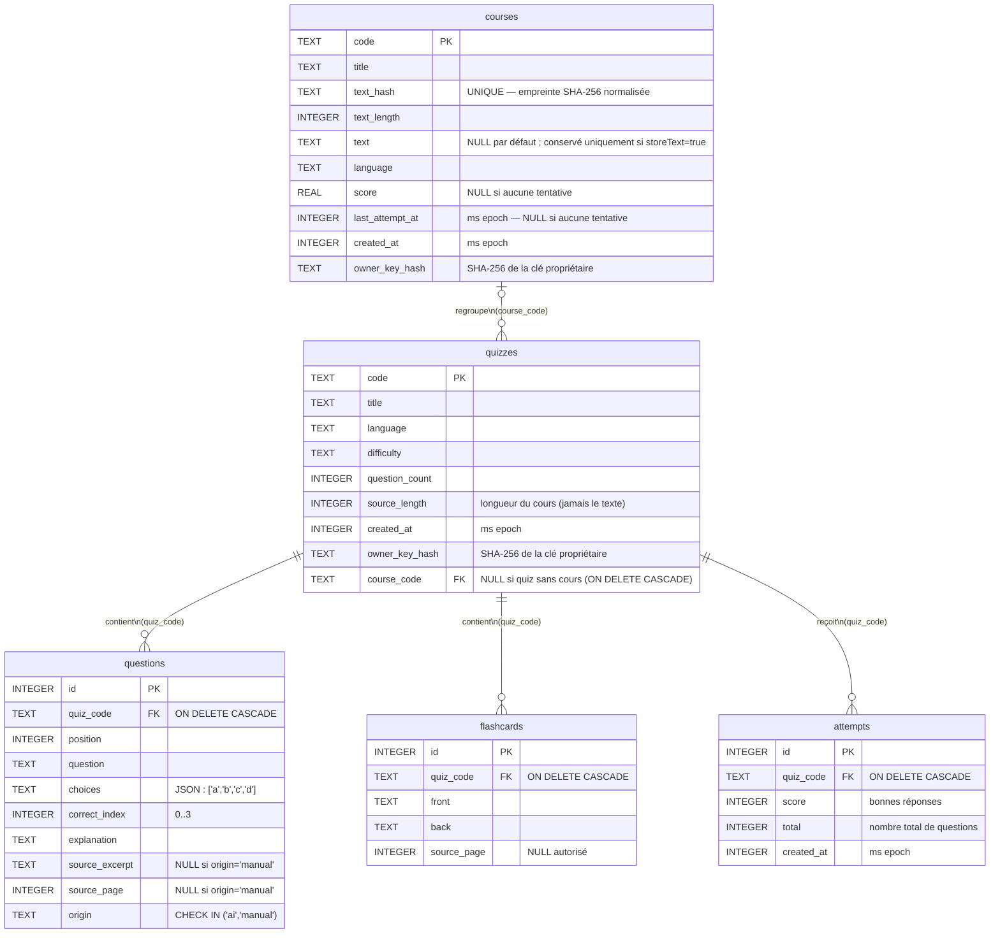

# Modèle conceptuel de données — Base SQLite

Tables réelles de `server/db/schema.sql`.

## Cardinalités exactes (schéma)

| Relation | Cardinalité | Règle |
|----------|-------------|-------|
| `courses` → `quizzes` | 0..1 à 0..N | `course_code` nullable des deux côtés : un quiz peut exister sans cours, un cours peut n'avoir aucun quiz |
| `quizzes` → `questions` | 1 à 1..N | Contrainte métier (MIN_QUESTIONS = 3, quizzes.controller.js), pas une contrainte SQL — le schéma seul autoriserait 0 |
| `quizzes` → `flashcards` | 1 à 0..N | Peut être vide |
| `quizzes` → `attempts` | 1 à 0..N | Aucune tentative si jamais joué |
| Suppression `courses` | CASCADE | Tous les quiz liés + leurs questions/flashcards/tentatives |
| Suppression `quizzes` | CASCADE | Questions, flashcards, tentatives liées |

## Principes de confidentialité (commentés dans schema.sql)

- `courses.text` : `NULL` par défaut. Le texte du cours n'est stocké **que** si
  l'utilisateur coche « conserver le texte » (`storeText=true`). Les quiz et
  questions ne contiennent **jamais** le texte du cours, seulement sa longueur
  (`source_length`) et l'extrait cité (`source_excerpt`).
- `courses.text_hash` : empreinte SHA-256 du texte **normalisé** (minuscules +
  espaces réduits), sert à reconnaître un même document re-déposé sans stocker
  le texte lui-même.
- `owner_key_hash` : SHA-256 de la clé propriétaire. La clé brute n'est jamais
  persistée ; elle est renvoyée une seule fois au client à la création.
