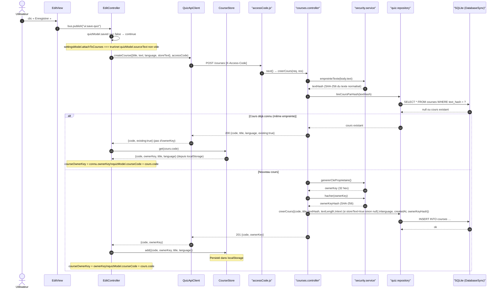

# Séquence CRUD (1/3) — Création / déduplication du cours

Portion 1 de `sequence-crud.md` (découpée pour tenir en annexe A4) :
`POST /courses` avec calcul d'empreinte et déduplication (cours déjà connu vs
nouveau cours). Le diagramme complet reste dans `sequence-crud.md`.

