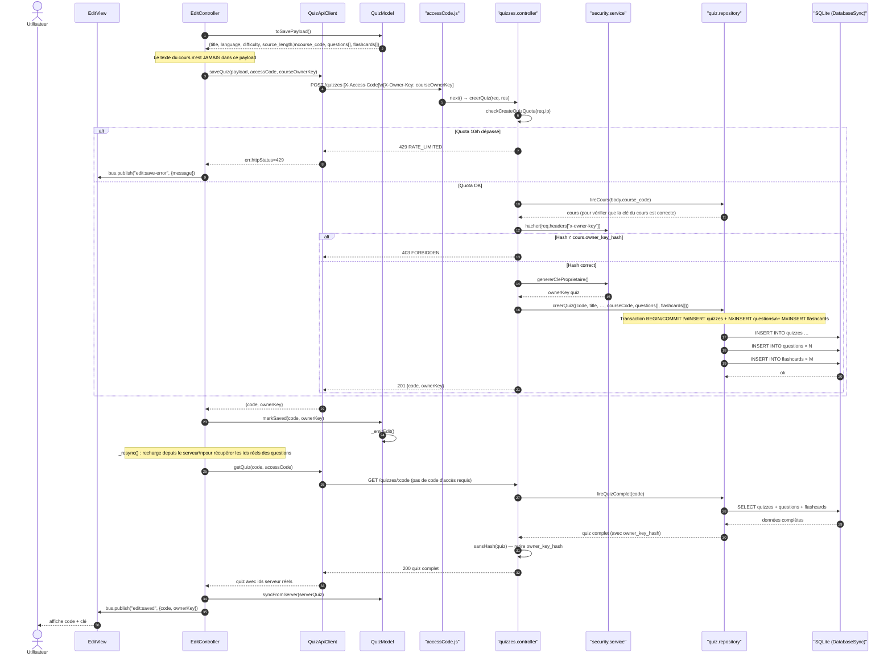

# Séquence CRUD (2/3) — Enregistrement du quiz rattaché

Portion 2 de `sequence-crud.md` (découpée pour tenir en annexe A4) :
`POST /quizzes` (quota, vérification de la clé du cours, transaction d'insertion)
puis re-synchronisation via `GET /quizzes/:code`. Le diagramme complet reste
dans `sequence-crud.md`.

