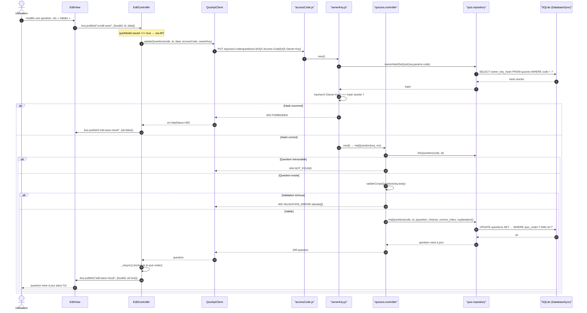

# Séquence CRUD (3/3) — Modification d'une question (X-Owner-Key)

Portion 3 de `sequence-crud.md` (découpée pour tenir en annexe A4) :
`PUT /quizzes/:code/questions/:id` avec vérification de la clé propriétaire par
le middleware `ownerKey.js`, puis validation et mise à jour. Le diagramme complet
reste dans `sequence-crud.md`.

