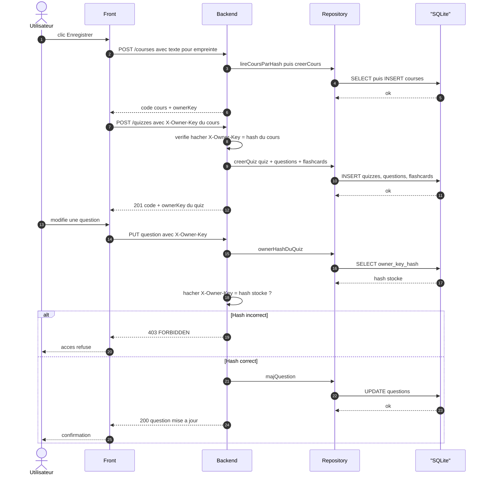

# Séquence — CRUD représentatif (version simplifiée)

Version condensée pour le rapport (complète en annexe : `sequence-crud.md`).
Un seul scénario : enregistrement d'un quiz rattaché à un cours, puis
modification d'une question avec vérification de la clé propriétaire.

