# Diagramme de séquence — CRUD représentatif

Flux : **enregistrement d'un quiz rattaché à un cours** (POST /courses puis
POST /quizzes avec vérification d'empreinte), puis **modification d'une question**
(PUT avec vérification X-Owner-Key).

```mermaid
sequenceDiagram
    autonumber
    actor Utilisateur
    participant EditView
    participant EditController
    participant QuizApiClient
    participant CourseStore
    participant QuizModel
    participant accessCode as "accessCode.js"
    participant ownerKey as "ownerKey.js"
    participant CoursesCtrl as "courses.controller"
    participant QuizzesCtrl as "quizzes.controller"
    participant SecurityService as "security.service"
    participant QuizRepository as "quiz.repository"
    participant DB as "SQLite (DatabaseSync)"

    %% ── ÉTAPE 1 : Enregistrement du quiz avec cours ──────────────────────

    Utilisateur ->> EditView: clic « Enregistrer »
    EditView ->> EditController: bus.publish("ui:save-quiz")
    EditController ->> EditController: quizModel.saved === false → continue

    Note over EditController: settingsModel.attachToCourses === true\net quizModel.sourceText non vide

    EditController ->> QuizApiClient: createCourse({title, text, language, storeText}, accessCode)
    QuizApiClient ->> accessCode: POST /courses [X-Access-Code]
    accessCode ->> CoursesCtrl: next() → creerCours(req, res)

    CoursesCtrl ->> SecurityService: empreinteTexte(body.text)
    SecurityService -->> CoursesCtrl: textHash (SHA-256 du texte normalisé)

    CoursesCtrl ->> QuizRepository: lireCoursParHash(textHash)
    QuizRepository ->> DB: SELECT * FROM courses WHERE text_hash = ?
    DB -->> QuizRepository: null ou cours existant

    alt Cours déjà connu (même empreinte)
        QuizRepository -->> CoursesCtrl: cours existant
        CoursesCtrl -->> QuizApiClient: 200 {code, title, language, existing:true}
        QuizApiClient -->> EditController: {code, existing:true} (pas d'ownerKey)
        EditController ->> CourseStore: get(cours.code)
        CourseStore -->> EditController: {code, ownerKey, title, language} (depuis localStorage)
        Note over EditController: courseOwnerKey = connu.ownerKey\nquizModel.courseCode = cours.code
    else Nouveau cours
        CoursesCtrl ->> SecurityService: genererCleProprietaire()
        SecurityService -->> CoursesCtrl: ownerKey (32 hex)
        CoursesCtrl ->> SecurityService: hacher(ownerKey)
        SecurityService -->> CoursesCtrl: ownerKeyHash (SHA-256)
        CoursesCtrl ->> QuizRepository: creerCours({code, title, textHash, textLength,\ntext (si storeText=true sinon null),\nlanguage, createdAt, ownerKeyHash})
        QuizRepository ->> DB: INSERT INTO courses …
        DB -->> QuizRepository: ok
        CoursesCtrl -->> QuizApiClient: 201 {code, ownerKey}
        QuizApiClient -->> EditController: {code, ownerKey}
        EditController ->> CourseStore: add({code, ownerKey, title, language})
        Note over CourseStore: Persisté dans localStorage
        Note over EditController: courseOwnerKey = ownerKey\nquizModel.courseCode = cours.code
    end

    %% ── ÉTAPE 2 : Enregistrement du quiz ─────────────────────────────────

    EditController ->> QuizModel: toSavePayload()
    QuizModel -->> EditController: {title, language, difficulty, source_length,\ncourse_code, questions[], flashcards[]}
    Note over EditController: Le texte du cours n'est JAMAIS dans ce payload

    EditController ->> QuizApiClient: saveQuiz(payload, accessCode, courseOwnerKey)
    QuizApiClient ->> accessCode: POST /quizzes [X-Access-Code]\n[X-Owner-Key: courseOwnerKey]
    accessCode ->> QuizzesCtrl: next() → creerQuiz(req, res)

    QuizzesCtrl ->> QuizzesCtrl: checkCreateQuizQuota(req.ip)
    alt Quota 10/h dépassé
        QuizzesCtrl -->> QuizApiClient: 429 RATE_LIMITED
        QuizApiClient -->> EditController: err.httpStatus=429
        EditController ->> EditView: bus.publish("edit:save-error", {message})
    else Quota OK
        QuizzesCtrl ->> QuizRepository: lireCours(body.course_code)
        QuizRepository -->> QuizzesCtrl: cours (pour vérifier que la clé du cours est correcte)
        QuizzesCtrl ->> SecurityService: hacher(req.headers["x-owner-key"])
        alt Hash ≠ cours.owner_key_hash
            QuizzesCtrl -->> QuizApiClient: 403 FORBIDDEN
        else Hash correct
            QuizzesCtrl ->> SecurityService: genererCleProprietaire()
            SecurityService -->> QuizzesCtrl: ownerKey quiz
            QuizzesCtrl ->> QuizRepository: creerQuiz({code, title, …, courseCode, questions[], flashcards[]})
            Note over QuizRepository: Transaction BEGIN/COMMIT :\nINSERT quizzes + N×INSERT questions\n+ M×INSERT flashcards
            QuizRepository ->> DB: INSERT INTO quizzes …
            QuizRepository ->> DB: INSERT INTO questions × N
            QuizRepository ->> DB: INSERT INTO flashcards × M
            DB -->> QuizRepository: ok
            QuizzesCtrl -->> QuizApiClient: 201 {code, ownerKey}
        end
    end

    QuizApiClient -->> EditController: {code, ownerKey}
    EditController ->> QuizModel: markSaved(code, ownerKey)
    QuizModel ->> QuizModel: _emitEdit()

    Note over EditController: _resync() : recharge depuis le serveur\npour récupérer les ids réels des questions
    EditController ->> QuizApiClient: getQuiz(code, accessCode)
    QuizApiClient ->> QuizzesCtrl: GET /quizzes/:code (pas de code d'accès requis)
    QuizzesCtrl ->> QuizRepository: lireQuizComplet(code)
    QuizRepository ->> DB: SELECT quizzes + questions + flashcards
    DB -->> QuizRepository: données complètes
    QuizRepository -->> QuizzesCtrl: quiz complet (avec owner_key_hash)
    QuizzesCtrl ->> QuizzesCtrl: sansHash(quiz) — retire owner_key_hash
    QuizzesCtrl -->> QuizApiClient: 200 quiz complet
    QuizApiClient -->> EditController: quiz avec ids serveur réels
    EditController ->> QuizModel: syncFromServer(serverQuiz)
    EditController ->> EditView: bus.publish("edit:saved", {code, ownerKey})
    EditView -->> Utilisateur: affiche code + clé

    %% ── ÉTAPE 3 : Modification d'une question ────────────────────────────

    Utilisateur ->> EditView: modifie une question, clic « Valider »
    EditView ->> EditController: bus.publish("ui:edit-save", {localId, id, data})

    Note over EditController: quizModel.saved === true → via API

    EditController ->> QuizApiClient: updateQuestion(code, id, data, accessCode, ownerKey)
    QuizApiClient ->> accessCode: PUT /quizzes/:code/questions/:id\n[X-Access-Code]\n[X-Owner-Key]
    accessCode ->> ownerKey: next()
    ownerKey ->> QuizRepository: ownerHashDuQuiz(req.params.code)
    QuizRepository ->> DB: SELECT owner_key_hash FROM quizzes WHERE code = ?
    DB -->> QuizRepository: hash stocké
    QuizRepository -->> ownerKey: hash
    ownerKey ->> ownerKey: hacher(X-Owner-Key) === hash stocké ?
    alt Hash incorrect
        ownerKey -->> QuizApiClient: 403 FORBIDDEN
        QuizApiClient -->> EditController: err.httpStatus=403
        EditController ->> EditView: bus.publish("edit:save-result", {ok:false})
    else Hash correct
        ownerKey ->> QuizzesCtrl: next() → majQuestion(req, res)
        QuizzesCtrl ->> QuizRepository: lireQuestion(code, id)
        alt Question introuvable
            QuizzesCtrl -->> QuizApiClient: 404 NOT_FOUND
        else Question existe
            QuizzesCtrl ->> QuizzesCtrl: validerCorpsQuestion(req.body)
            alt Validation échoue
                QuizzesCtrl -->> QuizApiClient: 400 VALIDATION_ERROR {details[]}
            else Valide
                QuizzesCtrl ->> QuizRepository: majQuestion(code, id, {question, choices, correct_index, explanation})
                QuizRepository ->> DB: UPDATE questions SET … WHERE quiz_code=? AND id=?
                DB -->> QuizRepository: ok
                QuizRepository -->> QuizzesCtrl: question mise à jour
                QuizzesCtrl -->> QuizApiClient: 200 question
                QuizApiClient -->> EditController: question
                EditController ->> EditController: _resync() [recharge le quiz entier]
                EditController ->> EditView: bus.publish("edit:save-result", {localId, ok:true})
                EditView -->> Utilisateur: question mise à jour dans l'UI
            end
        end
    end
```

