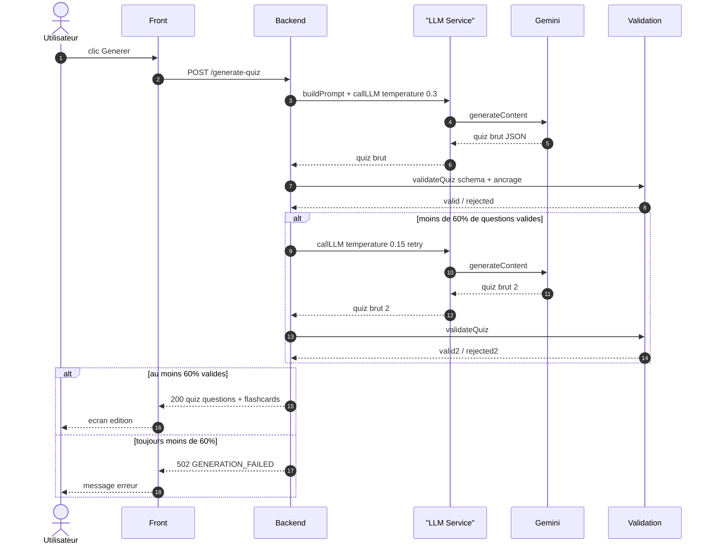

# Séquence — Génération d'un quiz (version simplifiée)

Version condensée pour le rapport (complète en annexe :
`sequence-generation.md`). La branche de retry (température 0.15 si moins de
60 % de questions valides) est conservée ; middlewares, quotas et événements
internes sont retirés.

