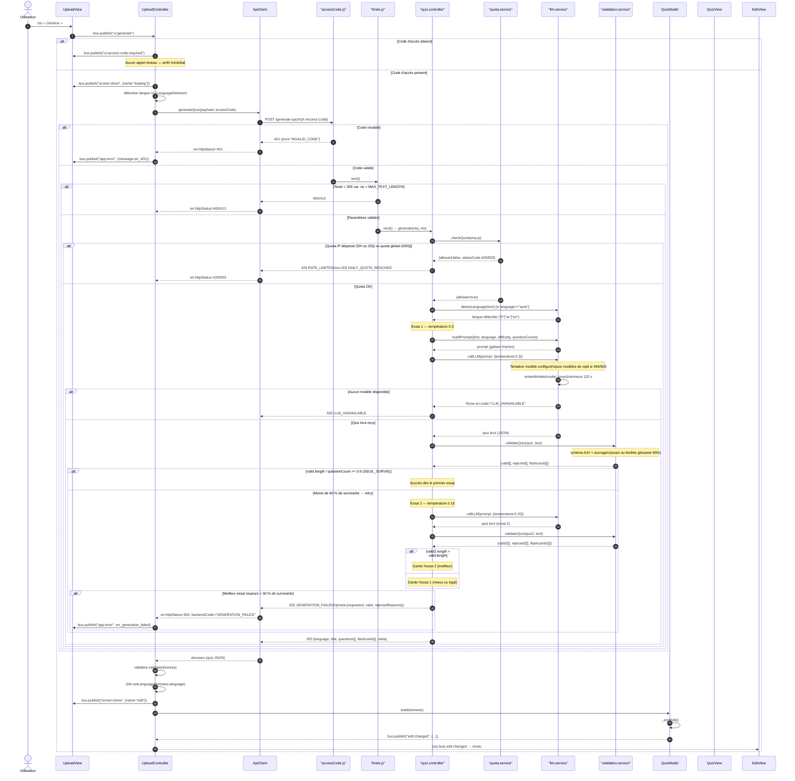

# Diagramme de séquence — Génération d'un quiz

Flux : saisie du texte → `UploadController` → `ApiClient` → route `POST /generate-quiz`
→ middlewares → `quiz.controller.generate` → services → réponse → `QuizModel` → `QuizView`.

La branche de **retry** (température 0.15 si < 60 % de survivants) est visible.

## Points clés du code réel

| Élément | Fichier | Détail |
|---------|---------|--------|
| Seuil retry | `quiz.controller.js:25` | `SEUIL_SURVIE = 0.6` |
| Température essai 1 | `quiz.controller.js:107` | `0.3` |
| Température essai 2 | `quiz.controller.js:115` | `0.15` |
| Choix du meilleur essai | `quiz.controller.js:117-119` | On garde l'essai 2 **seulement** s'il a plus de survivants |
| Timeout LLM | `llm.service.js:223` | 120 s (`AbortController`) |
| Modèle par défaut | `llm.service.js:42` | `gemini-3.5-flash` |
| Modèles de repli | `llm.service.js:47-52` | Basculé si 404 ou 503 Gemini |
| Ancrage | `validation.service.js:113-139` | Exact d'abord, puis fenêtre glissante 85 % |
| Motifs de rejet | `validation.service.js` | `SCHEMA_INVALID`, `EXPLANATION_TOO_SHORT`, `DUPLICATE_CHOICES`, `FORBIDDEN_CHOICE`, `EXCERPT_NOT_FOUND` |
