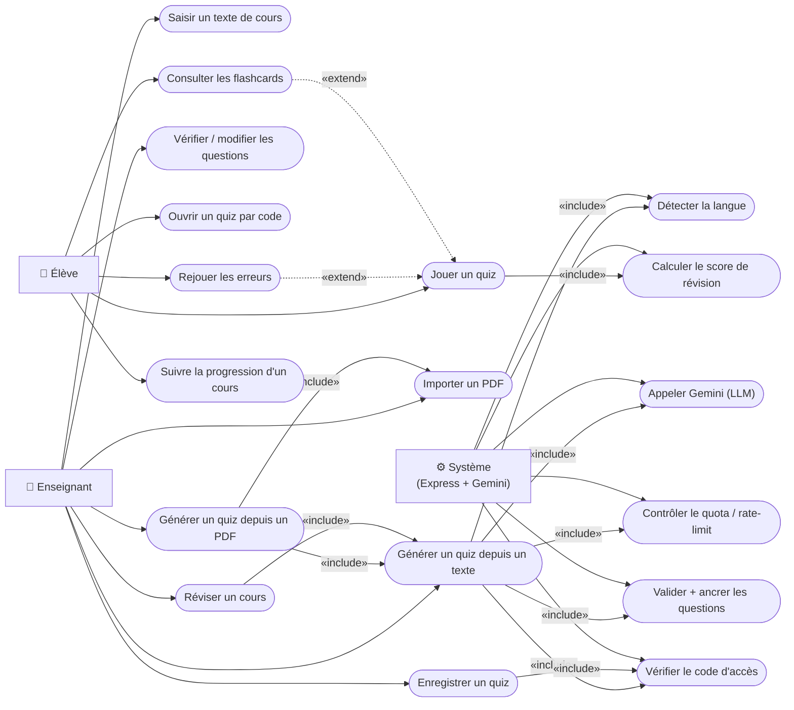

# Diagramme de cas d'utilisation

> Mermaid ne supporte pas nativement le diagramme UML `usecase`. Le bloc
> ci-dessous utilise un **flowchart** qui reproduit fidèlement la notation :
> ellipses pour les cas d'utilisation, rectangles pour les acteurs, flèches
> d'association et stéréotypes `<<include>>` / `<<extend>>`.

## Notes sur les acteurs et les cas

| Acteur | Rôle dans le code |
|--------|------------------|
| **Élève** | Ouvre un quiz par son code (6 caractères), joue, consulte les flashcards. N'a pas besoin de code d'accès pour les lectures. |
| **Enseignant** | Possède le code d'accès (`X-Access-Code`) et la clé propriétaire (`X-Owner-Key`). Dépose un texte ou un PDF, génère, édite, enregistre et suit la progression. |
| **Système** | Express + Gemini Flash. Détecte la langue (heuristique sans SDK), appelle Gemini via API REST, valide par ancrage (AJV + fenêtre glissante), gère quota/rate-limit en mémoire. |

### Règles d'accès réelles (middlewares)
- `requireAccessCode` (accessCode.js) : toutes les **écritures** (génération, POST/PUT/DELETE). Désactivé si `ACCESS_CODE` absent dans `.env` (mode dev).
- `ownerKeyRequired` (ownerKey.js) : PUT/DELETE d'un quiz ou d'un cours, CRUD des questions — compare SHA-256 de `X-Owner-Key` au hash stocké.
- Les **lectures** (GET /quizzes/:code, GET /courses/:code) sont libres : pas de code d'accès requis.
