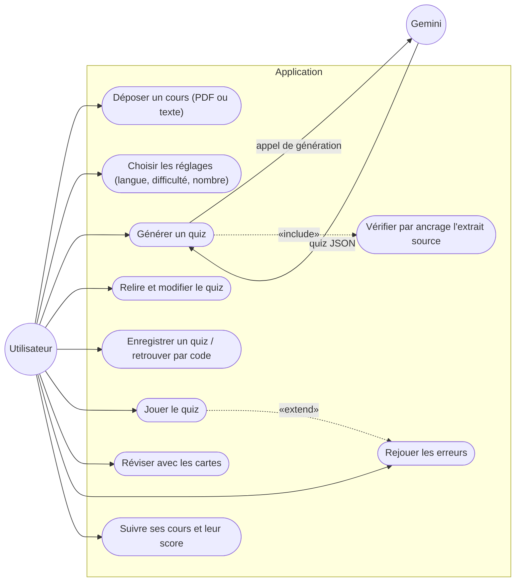

# Diagramme de cas d'utilisation (version simplifiée)

Mermaid n'a pas de diagramme de cas d'utilisation natif : on utilise un
`flowchart LR` avec l'acteur « Utilisateur » à gauche, les cas d'utilisation en
forme ovale dans un sous-graphe « Application », et « Gemini » comme acteur
externe à droite. Les cas correspondent aux routes de `server/routes/`
(`/generate-quiz`, CRUD `/quizzes`, `/courses`, `/attempts`) et aux écrans de
`public/js/views/` (dépôt, réglages, jeu, relecture, révision, cours).

L'ancrage (`UC4`) est inclus dans la génération : chaque `source_excerpt` produit
par Gemini doit exister réellement dans le cours, sinon la question est écartée
(`server/services/validation.service.js`). « Rejouer les erreurs » prolonge le
jeu du quiz uniquement lorsqu'il reste des réponses fausses (`ResultView.js`).
