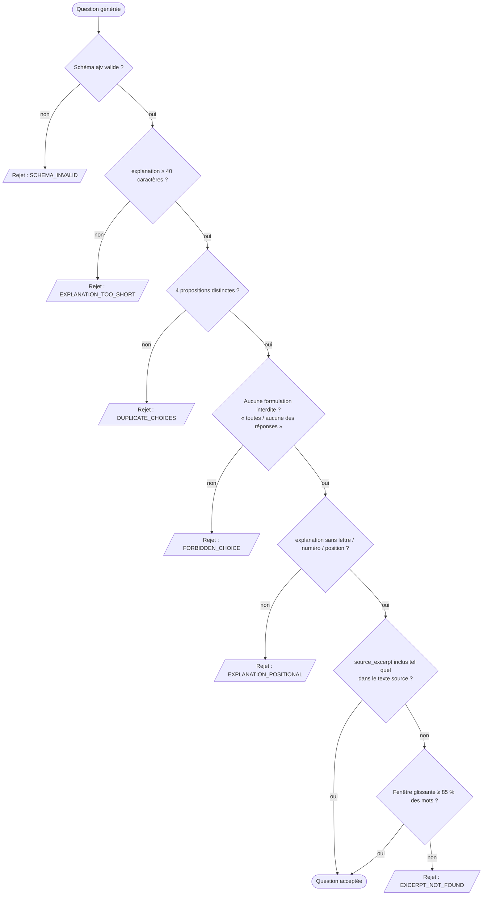

# Flux de validation d'une question (version simplifiée)

Enchaînement des contrôles appliqués à chaque question générée, dans l'ordre
exact de `server/services/validation.service.js` (`validateQuiz` →
`verifierSemantique` → `extraitAncre`). Une question n'est jamais corrigée :
au premier contrôle qui échoue, elle est écartée avec son motif de rejet. Seules
les questions qui passent toute la chaîne sont conservées.

L'ancrage se fait en deux temps (`extraitAncre`) : d'abord une inclusion exacte
après normalisation (minuscules, accents et ponctuation retirés, césures
recollées), sinon une correspondance approximative par fenêtre glissante exigeant
au moins 85 % des mots de l'extrait (`SEUIL_ANCRAGE_FLOU`). Les flashcards, elles,
ne sont vérifiées que sur leur schéma (pas d'ancrage) et sont simplement filtrées.
